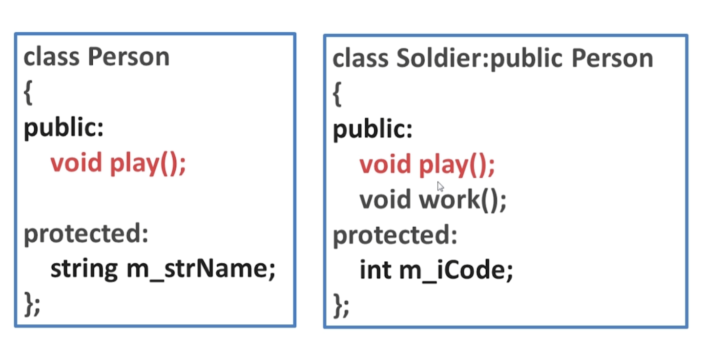
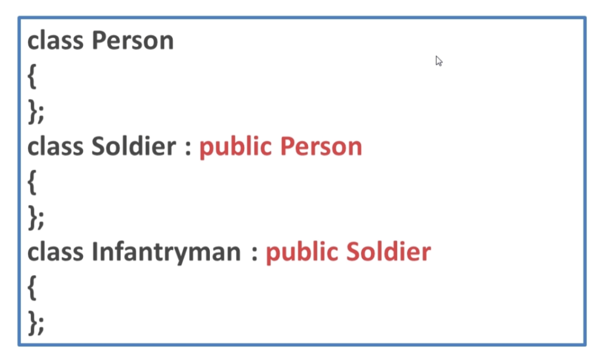
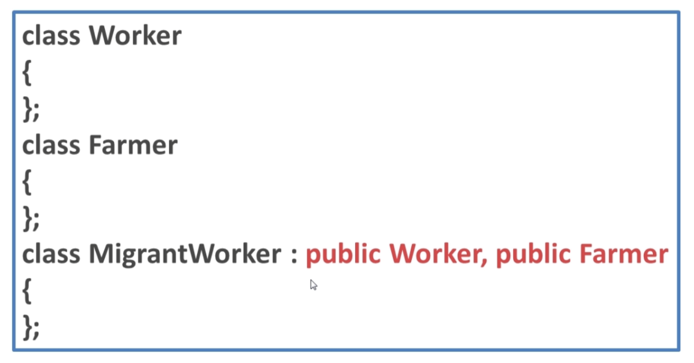
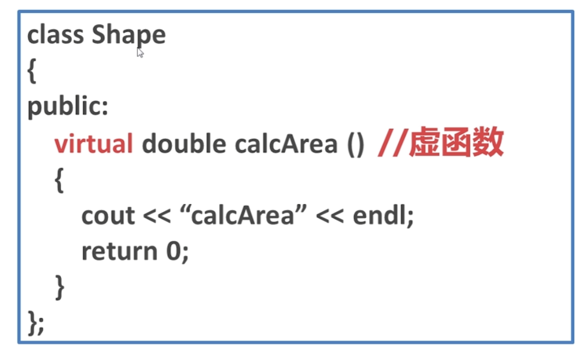
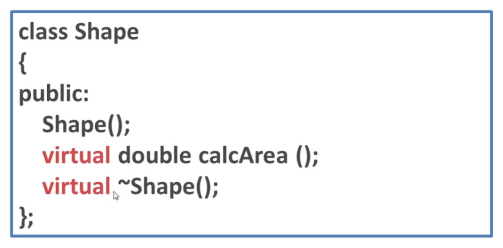

#### [C++远征之继承篇](https://www.imooc.com/learn/426)

- 隐藏

  父子关系

  成员函数或数据成员同名

  

- isA

  基类

  派生类

  虚析构函数 virtual

- 多重继承

  

- 多继承

  

- 虚继承

  

#### [C++远征之多态篇](https://www.imooc.com/learn/474)

- 静态多态(早绑定)

- 动态多态(晚绑定)

- 虚函数

  

- 虚析构函数

  

  virtual 不可以加在构造函数、静态成员函数和普通函数前

- 虚函数表、虚函数表指针

- 覆盖和隐藏