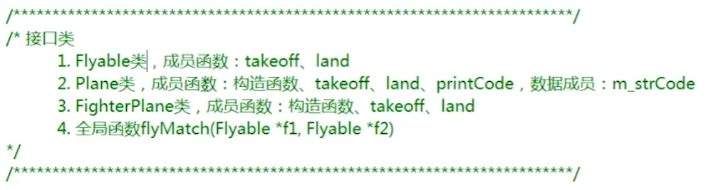

### [C++远征之继承篇](https://www.imooc.com/learn/426)

- 隐藏

  父子关系

  成员函数或数据成员同名

  

- isA

  基类

  派生类

  虚析构函数 virtual

- 多重继承

  

- 多继承

  

- 虚继承

  


### [C++远征之多态篇](https://www.imooc.com/learn/474)

- 静态多态(早绑定)

- 动态多态(晚绑定)

- 虚函数

  

- 虚析构函数

  

  virtual 不可以加在构造函数、静态成员函数和普通函数前

- 虚函数表、虚函数表指针

- 覆盖和隐藏


#### 抽象类

- 纯虚函数

- 不能实例化

- 子类实现抽象基类中的纯虚函数

  


#### 接口类

- 仅含有纯虚函数，无数据成员

- 表达一种能力或协议

  


#### RTTI

- 运行时类型识别

- type_id

  ```c++
  #include <iostream>
  #include <stdlib.h>
  #include <string>
  #include <typeinfo>
  using namespace std;
  
  /**
   * 定义移动类：Movable
   * 纯虚函数：move
   */
  class Movable
  {
  public:
      virtual void move() = 0;
  };
  
  /**
   * 定义公交车类：Bus
   * 公有继承移动类
   * 特有方法carry
   */
  class Bus : public Movable
  {
  public:
      virtual void move()
      {
          cout << "Bus -- move" << endl;
      }
      
      void carry()
      {
          cout << "Bus -- carry" << endl;
      }
  };
  
  /**
   * 定义坦克类：Tank
   * 公有继承移动类
   * 特有方法fire
   */
  class Tank : public Movable
  {
  public:
      virtual void move()
      {
          cout << "Tank -- move" << endl;
      }
  
      void fire()
      {
          cout << "Tank -- fire" << endl;
      }
  };
  
  /**
   * 定义函数doSomething含参数
   * 使用dynamic_cast转换类型
   */
  void doSomething(Movable *obj)
  {
      obj->move();
  
      if(typeid(*obj) == typeid(Bus))
      {
          Bus *bus = dynamic_cast<Bus *>(obj);
          bus->carry();
      }
  
      if(typeid(*obj) == typeid(Tank))
      {
          Tank *tank = dynamic_cast<Tank *>(obj);
          tank->fire();
      }
  }
  
  int main(void)
  {
      Bus b;
      Tank t;
      doSomething(&b);
      doSomething(&t);
      return 0;
  }
  ```


#### 异常

- 数组下标越界
- 除数为0
- 内存不足


### [C++远征之模板篇](https://www.imooc.com/learn/477)

#### 友元函数和友元类

- friend 关键字

- 传入对象，可访问private数据成员和函数

- 友元全局函数，友元成员函数

- ```c++
  #include <iostream>
  using namespace std;
  
  /**
   * 定义Coordinate类
   * 友元函数：display
   * 数据成员：m_iX、m_iY
   */
  class Coordinate
  {
      // 友元函数
      friend void display(Coordinate &coor);
  public:
  	Coordinate(int x, int y)
  	{
  		m_iX = x;
  		m_iY = y;
  	}
  public:
  	int m_iX;
  	int m_iY;
  };
  
  /**
   * display函数用于显示m_iX、m_iY的值
   */
  void display(Coordinate &coor)
  {
  	cout << "m_iX：" << coor.m_iX << endl;
  	cout << "m_iY：" << coor.m_iY << endl;
  }
  
  int main(void)
  {
      // 实例化Coordinate对象
  	Coordinate coor(3, 5);
      // 调用display函数
      display(coor);
  	return 0;
  }
  ```

- 友元类

  

  

- 友元关系不可传递

- 友元关系的单向性

- 友元声明的形式及数量不限制

- 是封装的补充

```c++
#include <iostream>
using namespace std;
class Watch;

/**
 * 定义Time类
 * 数据成员：m_iHour， m_iMinute，m_iSecond 
 * 成员函数：构造函数
 * 友元类：Watch
 */
class Time
{
    // 友元类
    friend class Watch;
public:
	Time(int hour, int min, int sec)
	{
		m_iHour = hour;
		m_iMinute = min;
		m_iSecond = sec;
	}
public:
	int m_iHour;
	int m_iMinute;
	int m_iSecond;
};

/**
 * 定义Watch类
 * 数据成员：m_tTime
 * 成员函数：构造函数
 * display用于显示时间
 */
class Watch
{
public:
	Watch(Time &t): m_tTime(t){}
	void display()
	{
		cout << m_tTime.m_iHour << endl;
		cout << m_tTime.m_iMinute << endl;
		cout << m_tTime.m_iSecond << endl;
	}
public:
	Time m_tTime;
};

int main()
{
	Time t(6, 30, 20);
	Watch w(t);
	w.display();

	return 0;
}

```


#### 静态

- static
- 静态数据成员、静态成员函数


#### 运算符重载

- operator


#### 函数模板

- template typename class

  

  ```c++
  #include <iostream>
  using namespace std;
  
  /**
   * 定义模板函数swapNum
   * 实现功能：交换两个数的位置
   */
  
  template <typename T>
  T swapNum(T a, T b)
  {
      T temp = a;
      a = b;
      b = temp;
  }
  
  int main(void)
  {
      int x = 10;
      int y = 20;
      // 调用模板函数
      swapNum(x, y);
          cout << "x = " << x << endl;
          cout << "y = " << y << endl;
  	return 0;
  }
  
  ```

- 类模板

  - 模板代码不能分离编译

  ```c++
  #include <iostream>
  using namespace std;
  
  /**
   * 定义一个矩形类模板Rect
   * 成员函数：calcArea()、calePerimeter()
   * 数据成员：m_length、m_height
   */
  template <typename T>
  class Rect
  {
  public:
      Rect(T length, T height);
      T calcArea();
      T calePerimeter();
  public:
  	T m_length;
  	T m_height;
  };
  
  /**
   * 类属性赋值
   */
  template <typename T>
  Rect<T>::Rect(T length, T height)
  {
  	m_length = length;
  	m_height = height;
  }
  
  /**
   * 面积方法实现
   */
  template <typename T>
  T Rect<T>::calcArea()
  {
  	return m_length * m_height;
  }
  
  /**
   * 周长方法实现
   */
  template <typename T>
  T Rect<T>::calePerimeter()
  {
  	return ( m_length + m_height) * 2;
  }
  
  int main(void)
  {
  	Rect<int> rect(3, 6);
  	cout << rect.calcArea() << endl;
  	cout << rect.calePerimeter() << endl;
  	return 0;
  }
  
  ```


#### 标准模板库

- STL
- vector
- list

```c++
#include <vector>
#include <map>
#include <string>
#include <iostream>
using namespace std;

int main(void)
{
    // 使用vector存储数字：3、4、8、4
    vector<int> vec;
    vec.push_back(3);
    vec.push_back(4);
    vec.push_back(8);
    vec.push_back(4);
    
    //循环打印数字
    for (int i = 0; i < vec.size(); i++) {
        cout << vec[i] << endl;
    }
    
    // 使用map来存储字符串键值对
    map<string, string> m;
    pair<string, string> p1("S", "Shang Hai");
    pair<string, string> p2("B", "Bei Jing");
    pair<string, string> p3("G", "Guang Zhou");
    
    m.insert(p1);
    m.insert(p2);
    m.insert(p3);
    // 打印map中数据
    map<string, string>::iterator itor;
    for (itor = m.begin(); itor != m.end(); itor++) {
        cout << itor -> first << endl;
        cout << itor -> second << endl;
    }
    
    return 0;
}
```


